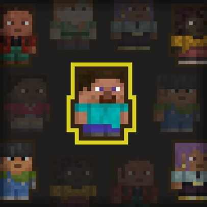

  [![Support Link-Banner [Boosty]](https://cdn.modrinth.com/data/cached_images/dce91fef079649dee277c52a998fc068e745e99e.png)](https://boosty.to/lopymine/donate)

 

# 💬 Description
Transparent Entities — Simple Client-Side Fabric mod which removes the annoying crowd by gradually hiding closest player and other entities.

**This mod only makes entities translucent, nothing more.**

---
### This mod requires "*Fabulous!*" graphics settings for for a better experience!
---

# ⚙️ Configuration Screen
You can also set the activation distances for hiding, full hiding and even minimum hiding level!

Also you can enable transparency for other entities:

# 🌟 Favorite Entities
You can also disable translucency for some players/entities in the world! You can do this via:

### 1) Social Interactions Screen

### 2) Commands

### 3) Hotkeys (hover over the entity and press the hotkey!)

